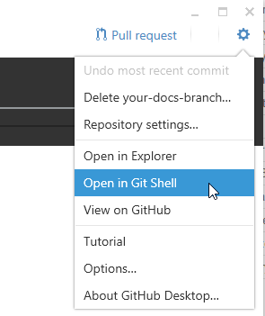
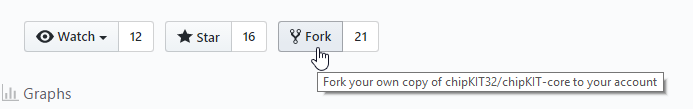
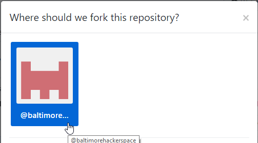
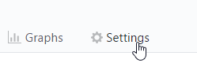
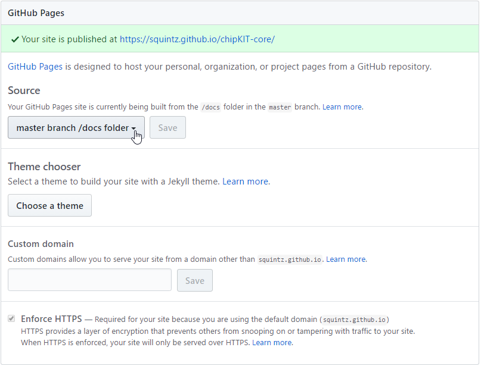
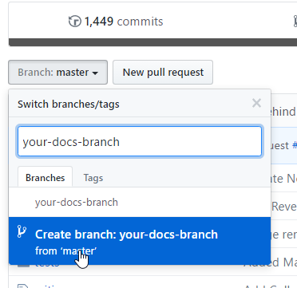
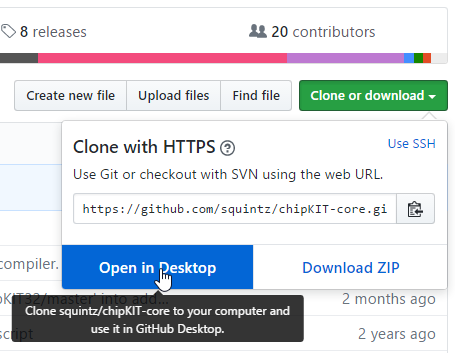
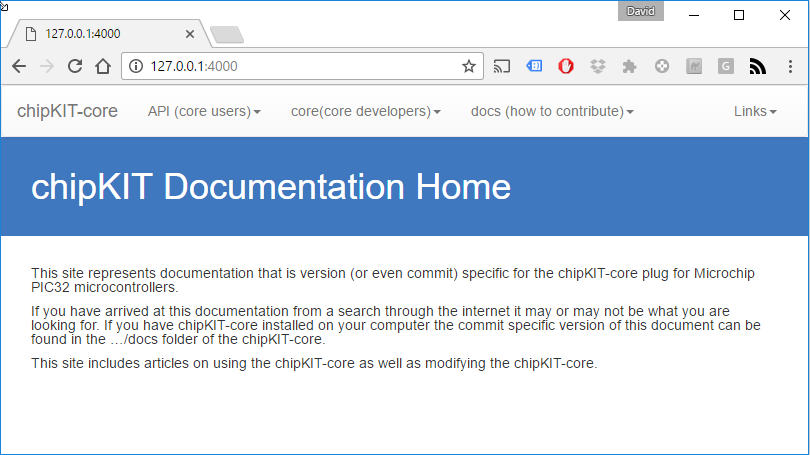
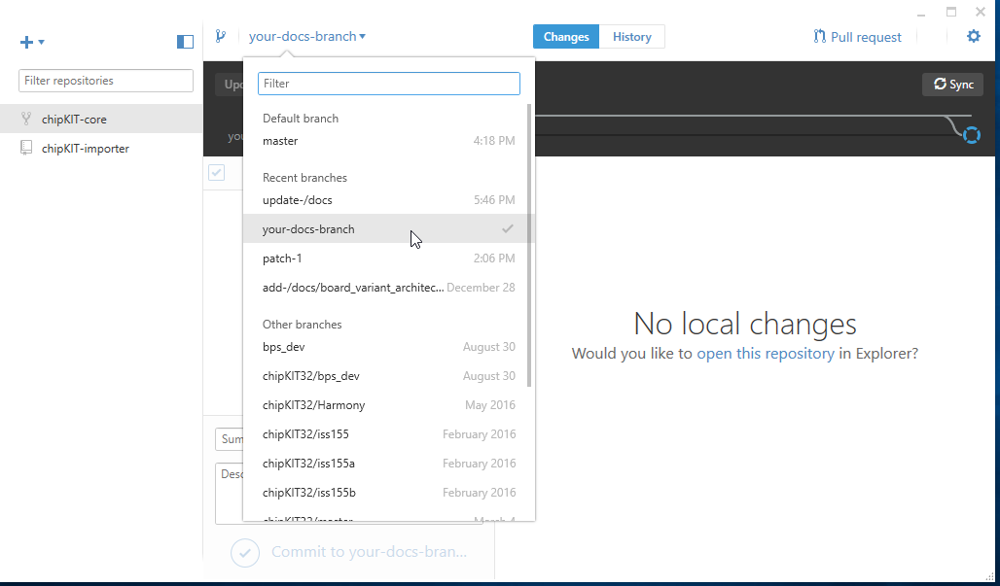
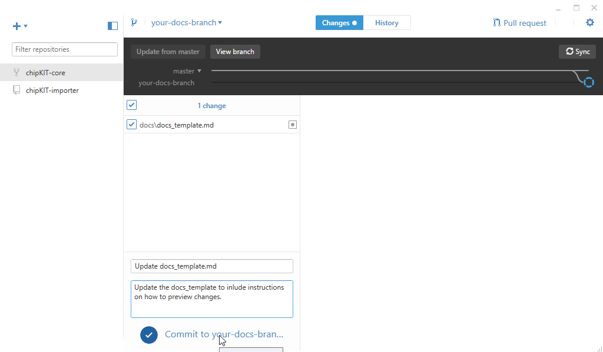

## Formatting Documents

All documents need to have something called YAML front matter. This is a section at the beginning of your document which starte with three dashes and ends with three dashes. In between these dashes you can specify the layout template you wish to use as well as the page title. The YAML is processed by a Jekyll engine by github. Here is an example:

<pre>
---
layout: default
title: How to add documentation to the docs folder
---
</pre>

## Adding Documents	

Add the document to the /docs folder in either HTML or Markdown (md) format. Note that HTML documents should not contain the HTML, Header, or Body tags since the documents contents will ultimately be inserted in a template which already contains these items.

## Update the Navigation Menu

In the _data folder you will find the nav.yml file. Update this file to add a link to your file.

## Local Preview of Changes (Windows)

If you are making significant changes to files in the docs/ folder you will need to verify your changes before submitting a pull request. Here's one way to do this on Windows using the GitHub Ddesktop application.

### Install GitHub Desktop

Download and Install GitHub Desktop from here: https://desktop.github.com/

### Install Jekyll

To install Jekyll bundle will rad the contents of the Gemfile in the docs directory.

1. From GitHub Desktop launch GitShell

	

2. Change directories

```console
 > cd docs
```

{:start="3"}
3. Install Jekyll

```console
 > bundle install
```

### Fork the chipKIT-Core Repo

1. From [https://github.com/chipKIT32/chipKIT-core](https://github.com/chipKIT32/chipKIT-core) click Fork

	
	
2. Then click on the user you want to Fork the repo too

	

### Enable Pages in Settings

1. From your repository page click the Settings tab

	
	
2. Scroll down and ensure master branch /docs folder is selected then hit save
	
	

	
### Create a New Branch

1. Click on Branch:master, type in a new branch name, and then click Create branch.

	

### Clone the Branch (Open in Desktop)

2. Click Clone or download and select Open in Desktop

	


### Start Local Jekyll Server

1. From GitShell ensure you are still in the docs folder.

2. Now you can start the jekyll local server

```console
> bundle exec jekyll serve
```

3. The output should look like the following:

```console
Windows PowerShell
Copyright (C) 2016 Microsoft Corporation. All rights reserved.

~\temp\folder\chipKIT-core\docs [your-docs-branch ≡ +0 ~1 -0 !]> bundle exec jekyll serve
Configuration file: none
Configuration file: none
            Source: C:/Users/boss/temp/folder/chipKIT-core/docs
       Destination: C:/Users/boss/temp/folder/hipKIT-core/docs/_site
 Incremental build: disabled. Enable with --incremental
      Generating...
                    done in 0.52 seconds.
  Please add the following to your Gemfile to avoid polling for changes:
    gem 'wdm', '>= 0.1.0' if Gem.win_platform?
 Auto-regeneration: enabled for 'C:/Users/boss/temp/folder/chipKIT-core/docs'
Configuration file: none
    Server address: http://127.0.0.1:4000/
  Server running... press ctrl-c to stop.
``` 


### Open in Browser (Test)

1. From your favorite browser navigate to http://127.0.0.1:4000/

	

### Making Edits to /docs

1. In GitHub Desktop ensure your branch is selected.

	

	
2. Now that you have jekyll serving your local files and your desired branch is active you can make edits to your local docments in the /docs folder or add new documents using your favorite text editor. When you save them GitHub desktop will automatically detect the changes. 

3. At this point you will be able to refresh your browser and see the changes you have made. Note that you'll need to navigate to the URL of the file you are creating or modifying.

### Commit your Changes

1. When you are happy with your changes go ahead and commit them and document your progress. This only commits to your personal github repo and does not overwrite the master chipKIT-core repo. That comes next!
	
	

### Create New Pull Request

1. When you are happy with your changes you may create a pull request. Again, this will not modify the master repo at this point. An admin will need to review your pull request and merger your changes. Note that you have two options here. You can create a pull request for your own repository or you can create a pull request for the master repository (default). To create a pull request for your own repository you need to select your repository and your branch from the New Pull Request page on github.com. 

### Merge Pull Request

1. If you are creating a pull request for your own repository then you will be able to merge the commit and see the results live at http://username.github.io/chipKIT-core.
